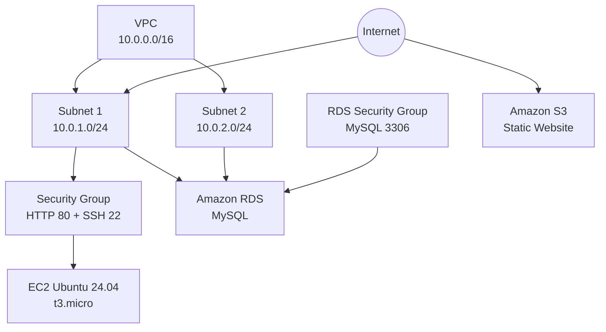

# Terraform AWS Self-Learn Project


A hands-on **Terraform** project built as part of my **DevOps self-learning exercises**.

The project provisions a complete environment in **AWS — Amazon Web Services** using **IaC — Infrastructure as Code**, including networking, compute, database, storage, security groups, and reusable Terraform configuration.

---

## Project Goals

This project is designed to practice and understand:

- Terraform configuration and workflow
- AWS Provider usage
- Resource dependencies
- Terraform State
- EC2 — Elastic Compute Cloud provisioning
- VPC — Virtual Private Cloud networking
- Subnets and Security Groups
- RDS — Relational Database Service
- S3 — Simple Storage Service static website hosting
- Variables and Outputs
- IAM — Identity and Access Management
- Git and GitHub workflow

---

## Architecture



---

## Project Structure

```text
learn-terraform-get-started-aws/
│
├── provider.tf
├── vpc.tf
├── ec2.tf
├── rds.tf
├── s3.tf
├── iam.tf
├── variables.tf
├── outputs.tf
├── .gitignore
├── .terraform.lock.hcl
└── README.md
```

| File | Purpose |
|---|---|
| `provider.tf` | AWS Provider configuration and Ubuntu AMI — Amazon Machine Image lookup |
| `vpc.tf` | VPC and subnet resources |
| `ec2.tf` | EC2 instance and EC2 Security Group |
| `rds.tf` | RDS database, DB Subnet Group, and RDS Security Group |
| `s3.tf` | S3 bucket and static website hosting |
| `iam.tf` | IAM resources for EC2-to-S3 access |
| `variables.tf` | Terraform input variables |
| `outputs.tf` | Useful Terraform outputs |
| `.gitignore` | Prevents State, credentials, keys, and local files from being committed |

---

# Infrastructure

## VPC — Virtual Private Cloud

The project creates a custom VPC:

```text
10.0.0.0/16
```

It currently contains:

```text
Subnet 1: 10.0.1.0/24
Subnet 2: 10.0.2.0/24
```

---

## EC2 — Elastic Compute Cloud

Terraform creates an Ubuntu server using the latest matching Ubuntu 24.04 AMI from Canonical.

```hcl
data "aws_ami" "ubuntu" {
  most_recent = true

  filter {
    name   = "name"
    values = ["ubuntu/images/hvm-ssd-gp3/ubuntu-noble-24.04-amd64-server-*"]
  }

  owners = ["099720109477"]
}
```

Current EC2 configuration:

```text
Instance Type: t3.micro
Operating System: Ubuntu 24.04
SSH Key Pair: avivhamoy
```

---

## Security Groups

The EC2 Security Group currently allows:

| Port | Protocol | Purpose |
|---|---|---|
| `22` | TCP — Transmission Control Protocol | SSH — Secure Shell |
| `80` | TCP — Transmission Control Protocol | HTTP — Hypertext Transfer Protocol |

The RDS Security Group allows:

| Port | Protocol | Purpose |
|---|---|---|
| `3306` | TCP — Transmission Control Protocol | MySQL |

The database rule references the EC2 Security Group instead of exposing MySQL directly to the entire internet.

---

## RDS — Relational Database Service

The project creates a MySQL database using Amazon RDS.

```text
Engine: MySQL
Instance Class: db.t3.micro
Storage: 20 GB gp3
Database Name: terraformdb
Public Access: Disabled
Multi-AZ — Multiple Availability Zones: Disabled
```

The database password is handled as a sensitive Terraform variable:

```hcl
variable "db_password" {
  description = "Password for the RDS database"
  type        = string
  sensitive   = true
}
```

---

## S3 — Simple Storage Service

The project creates an S3 bucket configured for static website hosting.

It includes:

```text
index.html
error.html
Static Website Configuration
Bucket Policy
Public Website Access
```

Terraform outputs the website address after deployment.

---

# Terraform Workflow

## Initialize

```bash
terraform init
```

## Format

```bash
terraform fmt
```

## Validate

```bash
terraform validate
```

## Preview Changes

```bash
terraform plan
```

Terraform compares:

```text
Configuration
     +
Terraform State
     +
Current Infrastructure
     ↓
Execution Plan
```

## Apply

```bash
terraform apply
```

Approve with:

```text
yes
```

## View Managed Resources

```bash
terraform state list
```

## Inspect a Resource

```bash
terraform state show aws_instance.app_server
```

## View Outputs

```bash
terraform output
```

Useful outputs include:

```text
EC2 Public IP
RDS Endpoint
S3 Bucket Name
S3 Website URL
```

## Destroy Infrastructure

```bash
terraform destroy
```

> Use this only when the environment is no longer needed.

---

# Terraform Dependency Example

Terraform does **not** execute resources simply from top to bottom.

```hcl
resource "aws_subnet" "main" {
  vpc_id = aws_vpc.main.id
}

resource "aws_vpc" "main" {
  cidr_block = "10.0.0.0/16"
}
```

Terraform understands:

```text
VPC
 ↓
Subnet
```

Terraform builds a **Dependency Graph** and creates resources in the required order.

---

# Terraform State

Terraform State acts as Terraform's memory.

```text
Terraform Configuration = What I want
Terraform State         = What Terraform knows
AWS Infrastructure      = What actually exists
```

---

# Git Safety

The project includes a `.gitignore` so sensitive or local files are not committed.

Do **not** commit:

```text
.terraform/
*.tfstate
*.tfstate.*
*.tfvars
*.tfvars.json
*.pem
*.key
*.backup
```

The Terraform lock file should normally remain in Git:

```text
.terraform.lock.hcl
```

---

# Example Git Workflow

```bash
git status
git add .
git commit -m "Add Terraform AWS infrastructure"
git push origin main
```

---

# Useful AWS CLI Commands

## Check current AWS identity

```bash
aws sts get-caller-identity
```

## List EC2 instances

```bash
aws ec2 describe-instances \
  --query "Reservations[].Instances[].{Name:Tags[?Key=='Name']|[0].Value,ID:InstanceId,State:State.Name,PublicIP:PublicIpAddress}" \
  --output table \
  --region us-east-1
```

## List RDS databases

```bash
aws rds describe-db-instances \
  --query "DBInstances[].{Name:DBInstanceIdentifier,Engine:Engine,Status:DBInstanceStatus,Endpoint:Endpoint.Address}" \
  --output table \
  --region us-east-1
```

## List S3 buckets

```bash
aws s3 ls
```

---

# What I Learned

During this project I practiced:

- Creating AWS infrastructure with Terraform
- Understanding Terraform dependencies
- Working with Terraform State
- Troubleshooting IAM permissions
- Creating VPC networking
- Provisioning Ubuntu EC2 instances
- Connecting EC2 and RDS through Security Groups
- Creating an S3 static website
- Splitting Terraform configuration into multiple `.tf` files
- Keeping State and sensitive files out of Git
- Using GitHub to version-control Infrastructure as Code

---

# Next Steps

- Complete the IAM role for EC2-to-S3 access
- Add automated RDS backups
- Restrict SSH access to a trusted IP address
- Add more Terraform variables
- Add reusable Terraform modules
- Add additional outputs
- Improve public and private subnet separation

---

## Author

**Aviv Hamoy**

DevOps Student  
Terraform + AWS Self-Learning Project
